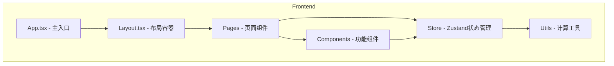

## 1. Architecture Design


## 2. Technology Description
- **Frontend**: React@18 + TypeScript + tailwindcss@3 + vite
- **Initialization Tool**: vite-init
- **Backend**: None（纯前端应用）
- **Database**: LocalStorage（历史记录存储）
- **Visualization**: Recharts（数据图表）
- **Icons**: Lucide-react

## 3. Route Definitions
| Route | Purpose |
|-------|---------|
| / | 主页面 - 参数控制与核心结果 |
| /length-analysis | 长度分布分析页面 |
| /history | 历史记录页面 |

## 4. Data Store Structure
### Zustand Store
```typescript
interface AppState {
  params: ModelParams;
  result: CalculationResult | null;
  history: CalculationResult[];
  
  updateParam: (key, value) => void;
  calculate: () => void;
  saveToHistory: () => void;
  loadFromHistory: (result) => void;
}
```

### Calculation Types
```typescript
interface ModelParams { n, k, pi_L, pi_R, q_cmp2, q_cmp3, q_deriv1, q_deriv2, gamma_1, gamma_2 }
interface SynchronicResult { total, E_cmp, E_noR, D, len_dist }
interface CalculationResult { synchronic, primaryNewMorphemes, primaryExtension, secondaryExtension, total }
```

## 5. File Structure
```
web-app/
├── src/
│   ├── pages/
│   │   ├── Home.tsx              # 主页面
│   │   ├── LengthAnalysis.tsx    # 长度分布分析
│   │   └── History.tsx           # 历史记录
│   ├── components/
│   │   ├── Layout/               # 布局组件
│   │   ├── ParamControl/         # 参数控制组件
│   │   └── ResultDisplay/        # 结果展示组件
│   ├── store/
│   │   └── useAppStore.ts        # Zustand状态管理
│   ├── utils/
│   │   └── calculator.ts         # 核心计算逻辑
│   ├── App.tsx
│   └── main.tsx
```
