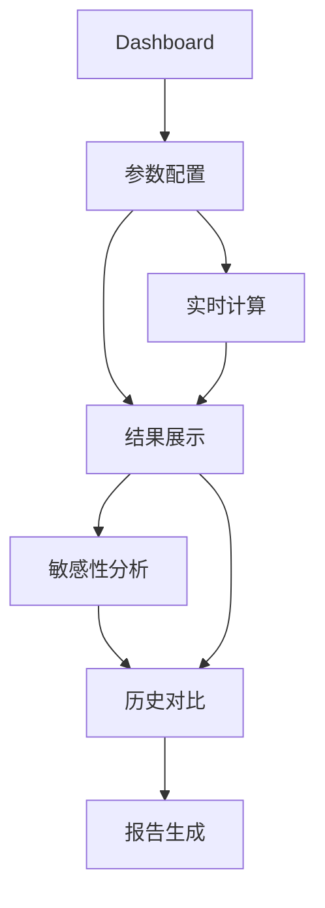

## 1. Product Overview

人造语言词汇规模估算高级分析平台，提供参数调整、实时计算、多维度可视化、参数敏感性分析、历史对比等功能。

- 为语言学家和设计者提供专业的工程估算工具
- 通过分层页面结构和高级可视化，实现深度分析与规划

---

## 2. Core Features

### 2.1 Feature Module

1. **Dashboard页面**：总览核心指标、实时验证状态、快速操作
2. **参数配置页面**：专业的参数分组配置、预设方案、实时验证
3. **结果展示页面**：多维度数据可视化、长度分布、分层构成分析
4. **敏感性分析页面**：参数敏感性曲线图、弹性分析、最优参数推荐
5. **历史对比页面**：历史记录管理、版本对比、配置导出/导入
6. **报告生成页面**：自动生成分析报告、数据导出功能

### 2.3 Page Details

| Page Name | Module Name | Feature description |
|-----------|-------------|---------------------|
| Dashboard | 总览卡片 | 总词汇量、三层构成、验证状态、关键指标 |
| Dashboard | 趋势预览 | 关键参数变化对结果的即时影响预览 |
| 参数配置 | 分组参数滑块 | 按5类参数分组配置、详细说明 |
| 参数配置 | 预设方案 | 快速加载预设配置、保存自定义方案 |
| 参数配置 | 参数关系图 | 可视化展示参数与结果的关联 |
| 结果展示 | 长度分布图表 | 柱状图+面积图、占比分析、详细表格 |
| 结果展示 | 三层构成分析 | 共时/一级/二级扩展的详细分解 |
| 结果展示 | 来源流向图 | Sankey图展示词汇来源与融合路径 |
| 敏感性分析 | 单参数曲线 | 每个参数对总词汇量的影响曲线 |
| 敏感性分析 | 多参数对比 | 弹性对比图表、敏感性热力图 |
| 敏感性分析 | 参数扫描 | 批量参数扫描、3D曲面可视化 |
| 历史对比 | 历史管理 | 版本时间线、标注系统、搜索筛选 |
| 历史对比 | 并排对比 | 两个版本的可视化对比分析 |
| 报告生成 | 报告模板 | 多种预设报告模板、自定义报告 |
| 报告生成 | 数据导出 | Excel/CSV/JSON多格式导出 |

---

## 3. Core Process

用户进入Dashboard查看总览 → 进入参数配置进行调整（或加载预设） → 查看结果展示的多维度分析 → 使用敏感性分析探索参数影响 → 保存到历史或生成报告。

---

## 4. User Interface Design

### 4.1 Design Style

- **主色调**：深蓝色（#1e40af）为主，辅以青色（#06b6d4）和橙色（#f97316）
- **强调色**：绿色（#10b981）表示验证通过，红色（#ef4444）表示警告
- **按钮风格**：圆角矩形，轻微阴影，悬停有上移和放大效果
- **字体**：Inter/Geist现代无衬线，标题bold，正文regular，数据使用等宽字体
- **布局风格**：左侧垂直导航（带二级菜单），顶部状态栏，右侧内容区域使用网格卡片布局
- **图标**：Lucide图标，统一线性风格
- **整体风格**：专业、现代、学术感，强调数据可视化，卡片式布局配合微妙阴影

### 4.2 Page Design Overview

| Page Name | Module Name | UI Elements |
|-----------|-------------|-------------|
| Dashboard | Hero区域 | 渐变背景、大数字展示、验证徽章、趋势箭头 |
| Dashboard | 指标卡片 | 4个核心指标、迷你图表、快速操作按钮 |
| 参数配置 | 参数分组 | 可折叠的分组面板、带说明的滑块、输入框 |
| 参数配置 | 预设方案 | 左侧方案列表、右侧预览、一键应用 |
| 结果展示 | 数据可视化 | 交互式柱状图、饼图、Sankey图、数据表格 |
| 敏感性分析 | 曲线图 | 多线图、区域选择、缩放工具、数据点提示 |
| 历史对比 | 时间线 | 垂直时间线、缩略预览、标注标签 |

### 4.3 Responsiveness

Desktop优先设计（1200px+最佳），支持响应式布局到平板，次要功能在移动端可折叠隐藏。

### 4.4 Interactive Elements

- **实时计算**：参数调整后0.3秒防抖自动重算
- **图表交互**：悬停提示、缩放、数据点选择、图例控制
- **参数同步**：滑块与输入框双向绑定
- **平滑动画**：页面切换、数据更新、卡片展开使用Spring动画
- **深色模式**：支持一键切换浅色/深色主题
