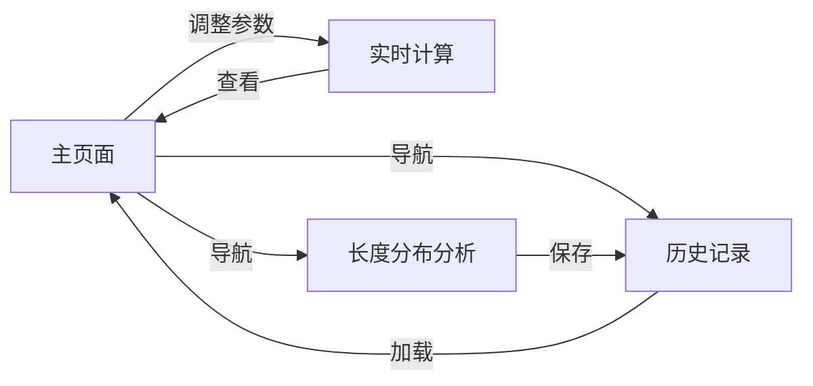

## 1. Product Overview
人造语言词汇规模估算可视化工具，提供参数控制、实时计算、词汇长度分布分析等功能
- 帮助语言学家和研究者理解和分析人造语言的词汇系统
- 通过直观的可视化和数据化展示，提升研究效率和决策质量

## 2. Core Features

### 2.2 Feature Module
1. **主页面 (Home)**: 参数控制面板、核心计算结果展示
2. **长度分布分析页面 (Length Analysis)**: 详细词汇长度分布可视化和数据分析
3. **历史记录页面 (History)**: 参数和计算结果的历史记录管理

### 2.3 Page Details
| Page Name | Module Name | Feature description |
|-----------|-------------|---------------------|
| Home page | 参数控制面板 | 12个核心参数的滑块和输入框控制，实时更新 |
| Home page | 核心结果展示 | 总词汇量、共时模型、一级扩展、二级扩展概览 |
| Length Analysis page | 长度分布图表 | 柱状图显示L1-L4分布，占比计算 |
| Length Analysis page | 详细数据表 | 各长度的精确数值和百分比 |
| History page | 历史记录列表 | 保存和加载历史参数组合 |

## 3. Core Process
用户进入主页面 → 调整参数 → 实时查看结果 → 点击左侧导航到长度分布页面 → 深入分析词汇构成 → 保存重要配置到历史记录

## 4. User Interface Design
### 4.1 Design Style
- **主色调**: 深蓝 (#1e3a8a) + 靛青 (#0ea5e9)
- **辅助色**: 中性灰 (#64748b, #94a3b8)
- **强调色**: 绿 (#059669, 验证状态)
- **按钮风格**: 圆角矩形，浅阴影，悬停有微妙上浮
- **字体**: 现代无衬线，标题中等粗细，正文清晰易读
- **布局风格**: 左侧固定导航面板，右侧内容区域卡片式布局
- **整体风格**: 简洁专业、学术感、清晰的视觉层次

### 4.2 Page Design Overview
| Page Name | Module Name | UI Elements |
|-----------|-------------|-------------|
| Home | 左侧导航栏 | 垂直布局，当前页面高亮 |
| Home | 参数卡片 | 分组展示，清晰标签，合理间距 |
| Length Analysis | 长度分布图表 | 清晰柱状图，悬停提示详细数据 |
| All | 统一卡片风格 | 浅白色背景，柔和阴影，圆角边框 |

### 4.3 Responsiveness
Desktop-first，支持1280px及以上最佳体验，响应式布局适配平板和移动设备

### 4.4 Layout Structure
- **左侧区域 (30%)**: 垂直导航栏 + 参数控制面板
- **右侧区域 (70%)**: 内容展示区，分为首页、长度分布分析、历史记录三个页面
- **重点突出**: 总词汇量在首页显著位置，长度分布在第二页面详细展示
